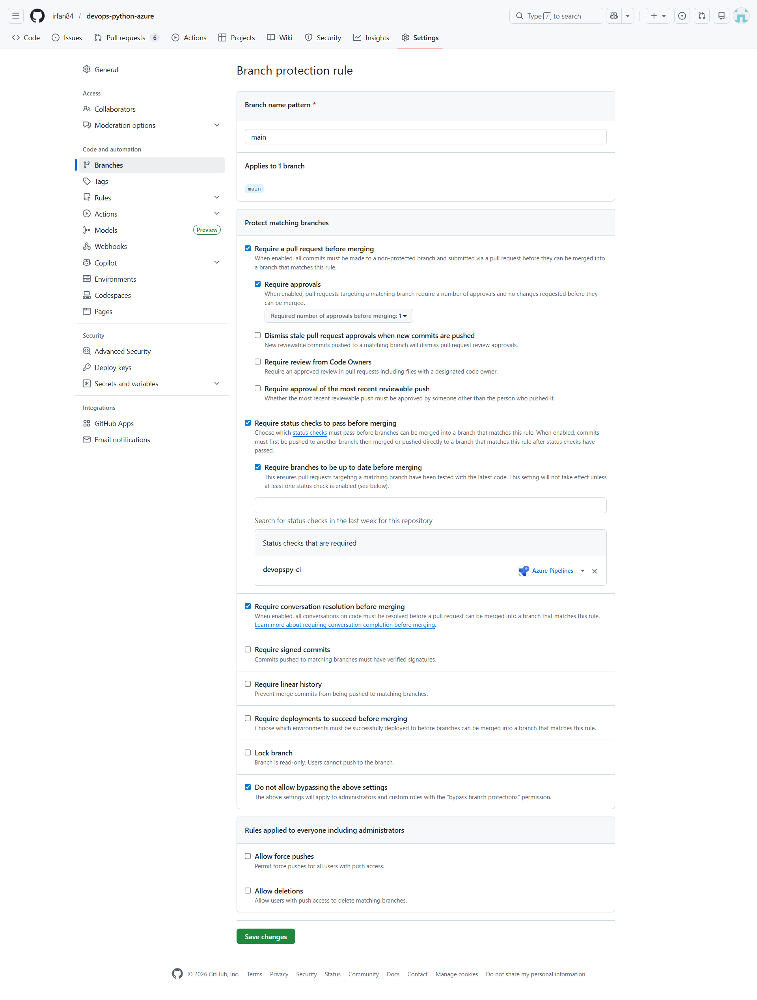
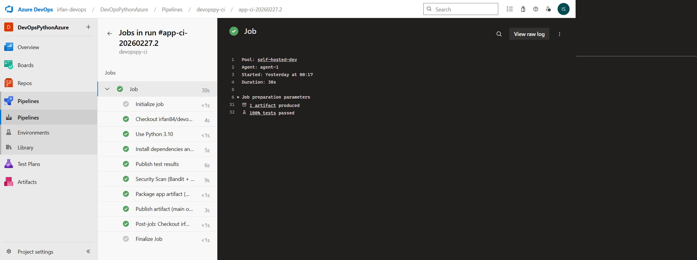
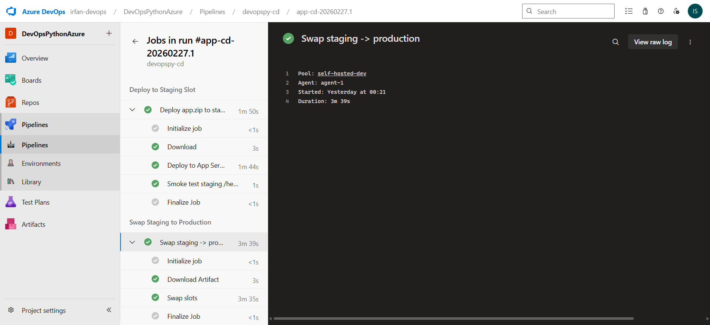
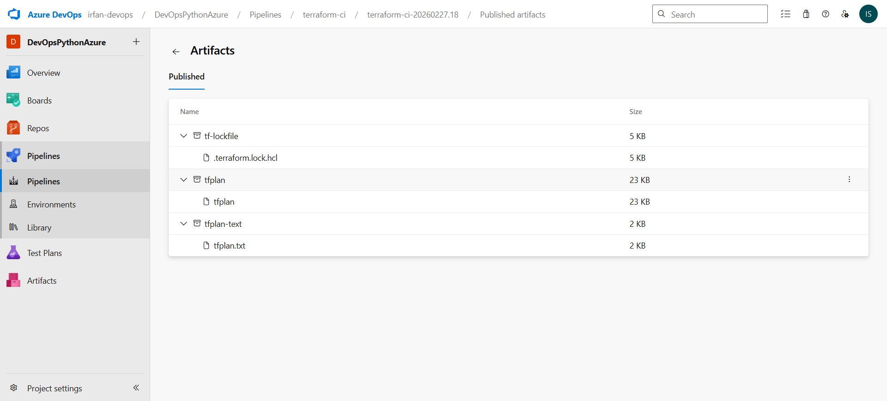
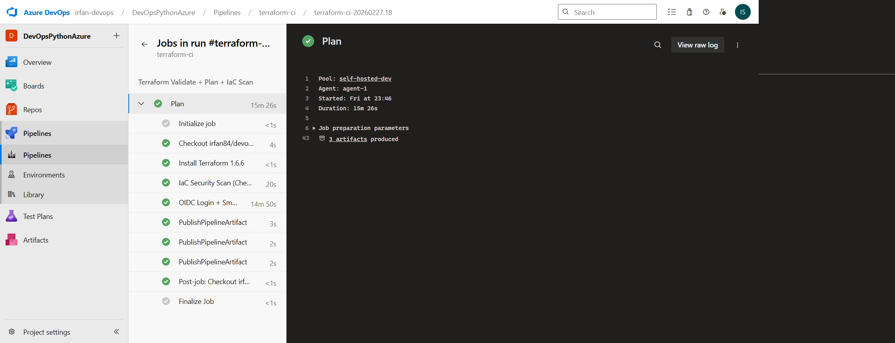
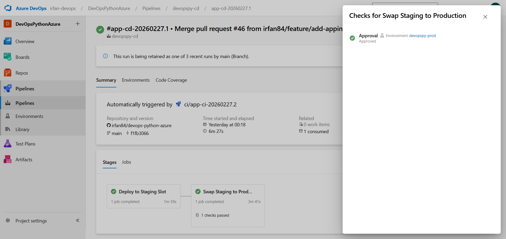
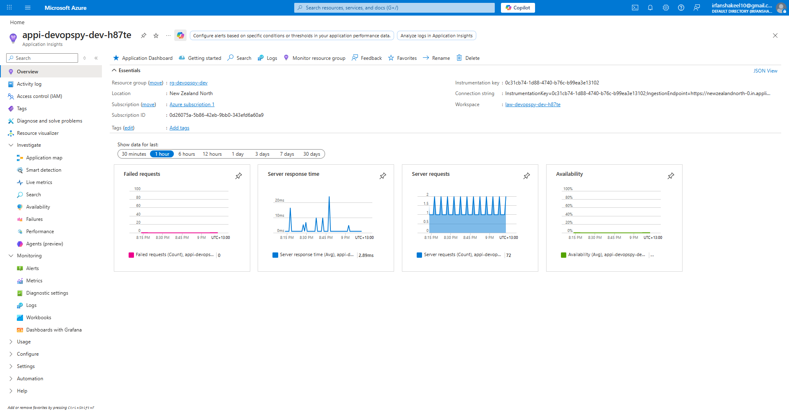

# 🚀 Enterprise DevOps Platform: Python on Azure
[](https://www.terraform.io/)
[](https://dev.azure.com/)
[](https://www.python.org/)
[](https://github.com/PyCQA/bandit)

A production-grade DevOps implementation demonstrating **Immutable Infrastructure**, **Automated Governance**, and **Zero-Downtime Application Delivery** on Microsoft Azure.

---

## 🏗 System Architecture

The architecture follows a strict **Separation of Concerns** (SoC) principle:
- **Infrastructure Layer:** Managed via Terraform with remote state locking.
- **Application Layer:** Python Flask app deployed via Blue-Green (Slot Swap) strategy.
- **Security Layer:** OIDC Workload Identity Federation (Secretless CI/CD).

---

## 🛡️ Governance & Branch Protection (Security Policies)
To maintain environment stability and security, I have implemented a **"No Direct Push"** policy on the `main` branch.

### OIDC Authentication:
No Azure Service Principal secrets are stored in the repo. Authentication is handled via **Workload Identity Federation**.

### Branch Protection Rules:
* **Require Pull Request:** Developers cannot push code directly to `main`.
* **Required Status Checks:** The **Application CI** and **Terraform CI** must pass successfully before a PR can be merged.
* **Review Requirements:** At least one authorized peer review is required.
* **Conversation Resolution:** All comments must be resolved before merging.

> **Evidence:** > 

---

## 🔄 CI/CD Pipeline Triggers
The automation logic is split into two distinct lifecycle phases:

### 1. Continuous Integration (CI)
**Trigger Condition:** Any `Pull Request` targeting the `main` branch or a `push` to a feature branch.
* **App CI:** Executes `Pytest` (Unit Testing) and `Bandit` (Security SAST).
* **Infra CI:** Executes `terraform validate`, `checkov` (IaC Scan), and `terraform plan`.
* **Goal:** Provides immediate feedback to the developer before code is merged.

> **Evidence:** > 

### 2. Continuous Deployment (CD)
**Trigger Condition:** A successful `Merge` (Push) into the `main` branch.
* **Infra CD:** Deploys the infrastructure changes to Azure using OIDC.
* **App CD:** Deploys the Python artifact to the **Staging Slot**, followed by a **Manual Approval Gate** for the final **Production Slot Swap**.

> **Evidence:** > 

---

## 🏗 Infrastructure as Code (Terraform)
Infrastructure is managed with a focus on security and state persistence.

* **Remote Backend:** State is stored in Azure Blob Storage (`nzdevopsstatestoresnjbl`) in RG `rg-tfstate-storage`.
* **Security Scanning:** Integrated **Checkov** to intercept misconfigurations.

> **Evidence:** > 
> 

---

## 🚀 Zero-Downtime Releases (Blue-Green)
I utilize **Azure App Service Slots** to ensure 100% availability.

1. **Deploy to Staging:** Artifact is pushed to the isolated staging environment.
2. **Smoke Testing:** Automated health checks verify the app is "Live."
3. **Manual Approval:** A DevOps Engineer reviews the staging logs.
4. **Swap:** Production and Staging slots are swapped instantly.

> **Evidence:** > 

---

## 📊 Observability & Monitoring
The platform utilizes the Azure Monitor stack for proactive incident response:
* **Application Insights:** Real-time performance and error tracking.
* **Smart Alerts:** Automated email triggers on HTTP 5xx errors.

> **Evidence:** > 

---

## 🔧 Local Development Setup

To replicate this environment locally for testing:

1. **Clone the Repository:**

```bash
git clone [https://github.com/irfan84/devops-python-azure.git](https://github.com/irfan84/devops-python-azure.git)
cd devops-python-azure
```
2. **Run the Application Locally:**

```bash
pip install -r requirements.txt
python app.py
```

3. **Initialize Terraform with Remote Backend:**

```bash
terraform init \
  -backend-config="resource_group_name=rg-tfstate-storage" \
  -backend-config="storage_account_name=nzdevopsstatestoresnjbl" \
  -backend-config="container_name=tfstate" \
  -backend-config="key=prod.terraform.tfstate"
```

4. **Run Security Scan Locally:**

```bash
# Infrastructure Scan
checkov -d .

# Application Scan (SAST)
bandit -r .
```